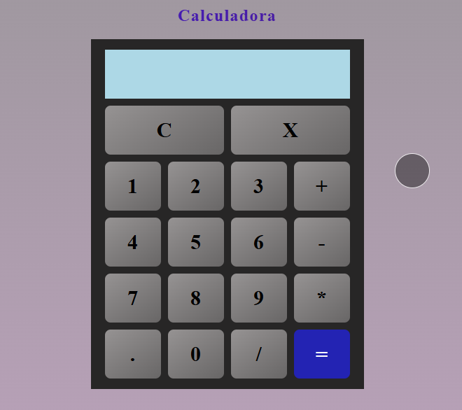

# Simple Calculator

This is a project to practice `JavaScript`.

# Stack

- `html5`
- `css4`
- `vanilla js`

# Topics

## Html and css

- Layout with `flex` and `grid`
- Pseudoclassess (like `:has()`)
- Selectors (like class selector, id selector, etc)
- Media queries
- Positioning
- Transitions
- Css nesting

## JS

- Event trigger
- Event delegation
- Use of `eval()` (do not use it for serious projects!)

# Presentation

Note: The circle with black shading comes from the **_pointermove_** event

  

